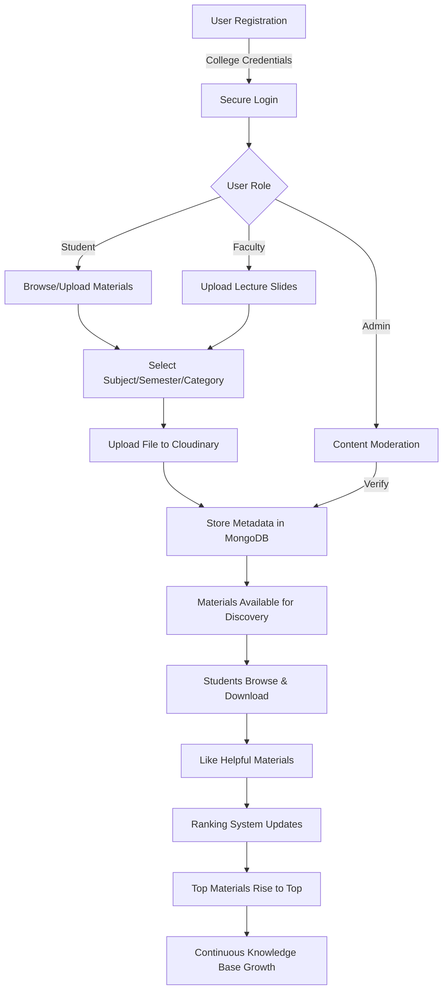

# StudyShare 📚

**A Centralized Academic Resource Sharing Platform for College Students and Faculty**

<!-- <div align="center"> -->
<!-- images -->


[Features](#-features) • [Tech Stack](#-tech-stack) • [Getting Started](#-getting-started) • [Workflow](#-workflow) • [Contributing](#-contributing)
<!-- </div> -->

## 📊 Project Status


## 🎯 Overview

StudyShare is a modern, centralized web-based platform designed to revolutionize how college students and faculty share and access academic materials. By providing a structured environment for uploading, organizing, and discovering study resources, StudyShare promotes collaborative learning and ensures knowledge continuity across batches.

### 🚀 Why StudyShare?

In today's academic environment, students struggle with:
- **Scattered Resources**: Study materials spread across WhatsApp groups, personal devices, and limited Google Drives
- **Lack of Centralization**: No formal platform for faculty-student resource sharing
- **Quality Concerns**: Inconsistent and unverified materials from informal sources
- **Accessibility Issues**: Juniors struggle to find reliable resources from seniors and faculty
- **Last-Minute Chaos**: Difficulty finding materials when needed most

StudyShare addresses these challenges by providing a **single source of truth** for all academic resources.

---

## ✨ Features

### 📤 Upload & Share
- **Multi-Format Support**: Upload notes, PYQs, PDFs, PPTs, and documents
- **Faculty Integration**: Professors can share lecture slides and official materials
- **Easy Categorization**: Organize by subject, semester, and department

### 🔍 Smart Discovery
- **Intelligent Search**: Find materials quickly with AI-assisted search
- **Content Ranking**: Like system highlights the most useful resources
- **Quality Filtering**: Popular materials rise to the top based on student preference

### 🔐 Secure Access
- **Authenticated Login**: Secure registration using college credentials
- **Role-Based Access**: Separate permissions for students, faculty, and administrators
- **JWT Authentication**: Stateless and secure authentication mechanism

### 🤖 AI-Powered Features
- **Gemini AI Integration**: Smart content recommendations and intelligent assistance
- **Enhanced Search**: AI-driven content discovery
- **Future-Ready**: Foundation for advanced AI features

### 👥 Collaborative Learning
- **Cross-Batch Sharing**: Seniors help juniors with handwritten notes and resources
- **Faculty Contributions**: Direct access to verified faculty materials
- **Community Driven**: Students contribute and benefit collectively

### 🛡️ Content Moderation
- **Admin Verification**: Optional moderation for quality control
- **Relevance Checks**: Ensures uploaded content meets platform standards
- **Misuse Prevention**: Protects against inappropriate content

---

## 🛠️ Tech Stack


### Frontend
| Technology | Purpose |
|------------|---------|
| **Next.js** | React framework for server-side rendering and optimal performance |
| **React.js** | Component-based UI library for building interactive interfaces |
| **TypeScript** | Type-safe JavaScript for better code quality and maintainability |
| **Tailwind CSS** | Utility-first CSS framework for responsive, modern design |
| **shadcn/UI** | Reusable and accessible UI component library |

### Backend
| Technology | Purpose |
|------------|---------|
| **Node.js** | Efficient, non-blocking server runtime |
| **Express.js** | Lightweight framework for RESTful API development |
| **TypeScript** | Enhanced code reliability and developer experience |

### Database & Storage
| Technology | Purpose |
|------------|---------|
| **MongoDB** | NoSQL database for flexible, hierarchical data storage |
| **Firebase** | Cloud services for real-time updates and future enhancements |
| **Cloudinary** | Secure, scalable cloud storage for PDF documents and files |

### Authentication & Security
| Technology | Purpose |
|------------|---------|
| **JWT (JSON Web Tokens)** | Secure, stateless authentication and authorization |

### AI & Innovation
| Technology | Purpose |
|------------|---------|
| **Gemini AI** | Intelligent features, content recommendations, and smart search |

---

## 🔄 Workflow



### Step-by-Step Process

1. **🔐 User Registration & Login**
   - Users register with verified college credentials
   - Secure authentication via JWT tokens
   - Role assignment (Student/Faculty/Admin)

2. **📤 Material Upload**
   - Upload notes, PYQs, or study materials
   - Categorize by subject, semester, and department
   - Files securely stored in Cloudinary

3. **✅ Content Moderation** *(Optional)*
   - Admin reviews uploads for relevance
   - Quality assurance and misuse prevention
   - Approved content becomes publicly accessible

4. **🔍 Access & Interaction**
   - Students browse organized materials
   - Download resources for offline study
   - Like helpful materials to support peers

5. **⭐ Ranking System**
   - Materials ranked by likes and engagement
   - Most useful content appears at the top
   - Quality resources get maximum visibility

6. **📈 Continuous Improvement**
   - New materials added every semester
   - Knowledge base grows year after year
   - Cross-generational learning support

---

## 🚀 Getting Started

### Prerequisites

- **Node.js** (v16 or higher)
- **npm** or **yarn**
- **MongoDB** (local or cloud instance)
- **Cloudinary Account** (for file storage)
- **Gemini AI API Key** (for AI features)

### Installation

1. **Clone the repository**
   ```bash
   git clone https://github.com/satendra03/study-share.git
   cd study-share
   ```

2. **Install dependencies**
   ```bash
   # Install backend dependencies
   cd backend
   npm install

   # Install frontend dependencies
   cd ../frontend
   npm install
   ```

3. **Environment Configuration**

   Create `.env` files in both frontend and backend directories:

   **Backend `.env`:**
   ```env
   PORT=5000
   MONGODB_URI=your_mongodb_connection_string
   JWT_SECRET=your_jwt_secret_key
   CLOUDINARY_CLOUD_NAME=your_cloudinary_cloud_name
   CLOUDINARY_API_KEY=your_cloudinary_api_key
   CLOUDINARY_API_SECRET=your_cloudinary_api_secret
   GEMINI_API_KEY=your_gemini_api_key
   FRONTEND_URL=http://localhost:3000
   ```

   **Frontend `.env.local`:**
   ```env
   NEXT_PUBLIC_API_URL=http://localhost:5000
   ```

4. **Run the application**

   ```bash
   # Start backend server
   cd backend
   npm run dev

   # Start frontend (in a new terminal)
   cd frontend
   npm run dev
   ```

5. **Access the application**
   - Frontend: `http://localhost:3000`
   - Backend API: `http://localhost:5000`

---

## 📁 Project Structure

```
studyshare/
├── frontend/                 # Next.js frontend application
│   ├── app/                 # Next.js app directory
│   ├── components/          # React components
│   │   ├── ui/             # shadcn/UI components
│   │   └── ...             # Custom components
│   ├── lib/                # Utility functions
│   ├── public/             # Static assets
│   └── styles/             # Global styles
│
├── backend/                 # Express.js backend application
│   ├── src/
│   │   ├── models/         # MongoDB schemas
│   │   ├── routes/         # API routes
│   │   ├── controllers/    # Business logic
│   │   ├── middleware/     # Authentication & validation
│   │   ├── config/         # Configuration files
│   │   └── utils/          # Helper functions
│   └── server.js           # Entry point
│
└── README.md               # Project documentation
```

---

## 🎨 Key Functionalities

### For Students
- ✅ Browse and download study materials by subject and semester
- ✅ Upload and share personal notes with peers
- ✅ Like helpful resources to boost their visibility
- ✅ Access handwritten notes from seniors
- ✅ Save time finding quality materials

### For Faculty
- ✅ Share official lecture slides and resources
- ✅ Contribute verified study materials
- ✅ Direct communication channel with students
- ✅ Support structured learning

### For Administrators
- ✅ Manage users and roles
- ✅ Moderate uploaded content
- ✅ Add/edit subjects and semesters
- ✅ Maintain platform quality
- ✅ Delete inappropriate content

---

## 📡 API Endpoints

### Authentication
- `POST /api/auth/register` - Register new user
- `POST /api/auth/login` - User login
- `GET /api/auth/me` - Get current user

### Materials
- `GET /api/materials` - Get all materials (with filters)
- `GET /api/materials/:id` - Get single material
- `POST /api/materials` - Upload new material
- `PUT /api/materials/:id` - Update material
- `DELETE /api/materials/:id` - Delete material
- `POST /api/materials/:id/like` - Like/unlike material

### Subjects
- `GET /api/subjects` - Get all subjects
- `POST /api/subjects` - Create subject (Admin only)
- `PUT /api/subjects/:id` - Update subject (Admin only)
- `DELETE /api/subjects/:id` - Delete subject (Admin only)

### Users (Admin)
- `GET /api/users` - Get all users
- `PUT /api/users/:id/role` - Update user role
- `DELETE /api/users/:id` - Delete user

### AI Features
- `POST /api/ai/recommend` - Get AI recommendations
- `POST /api/ai/search` - AI-powered search

---

## 🔒 Security Features

- **JWT Authentication**: Secure token-based authentication
- **Role-Based Access Control**: Granular permissions for different user types
- **Input Validation**: Server-side validation for all user inputs
- **Secure File Upload**: Cloudinary handles file security and validation
- **Environment Variables**: Sensitive data protected via environment configuration
- **Rate Limiting**: Protection against brute force attacks
- **Helmet.js**: Security headers for Express apps
- **CORS Configuration**: Controlled cross-origin requests

---

## 🧪 Testing

```bash
# Run backend tests
cd backend
npm test

# Run frontend tests
cd frontend
npm test
```

---

## 🌟 Future Enhancements

- [ ] 📱 Mobile application (iOS & Android)
- [ ] 🔔 Real-time notifications for new uploads
- [ ] 💬 Discussion forums for each subject
- [ ] 📊 Analytics dashboard for popular materials
- [ ] 🎯 Personalized content recommendations
- [ ] 🌐 Multi-language support
- [ ] 📧 Email notifications for updates
- [ ] 🏆 Gamification with contributor badges
- [ ] 📝 Rich text editor for notes
- [ ] 🔍 Advanced search with filters
- [ ] 📈 User statistics and contributions tracking
- [ ] 🎨 Theme customization (Dark/Light mode)

---

## 🤝 Contributing

We welcome contributions from the community! Here's how you can help:

1. **Fork the repository**
2. **Create a feature branch** (`git checkout -b feature/AmazingFeature`)
3. **Commit your changes** (`git commit -m 'Add some AmazingFeature'`)
4. **Push to the branch** (`git push origin feature/AmazingFeature`)
5. **Open a Pull Request**

### Contribution Guidelines
- Follow the existing code style
- Write clear commit messages
- Add tests for new features
- Update documentation as needed
- Ensure all tests pass before submitting PR

---

## 📝 Code of Conduct

This project follows the [Contributor Covenant Code of Conduct](CODE_OF_CONDUCT.md). By participating, you are expected to uphold this code.

---

## 📄 License

This project is licensed under the MIT License - see the [LICENSE](LICENSE) file for details.

---

## Additional terms

- [Terms of Service](TERMS_OF_SERVICE.md)
- [Privacy Policy](PRIVACY_POLICY.md)

---

## 👥 Authors

- **Satendra Kumar Parteti** - *Initial work* - [GitHub Profile](https://github.com/satendra03)

See also the list of [contributors](https://github.com/satendra03/Study-Share/contributors) who participated in this project.

---

## 🙏 Acknowledgments

- Thanks to all contributors who help make StudyShare better
- Inspired by the need for better academic resource sharing
- Built with modern technologies for scalability and performance
- Special thanks to the open-source community

---

## 📞 Support

For support, email [satendrakumarparteti.work@gmail.com](mailto:satendrakumarparteti.work@gmail.com) or open an [issue on GitHub.](https://github.com/satendra03/Study-Share/issues)

### Reporting Issues

If you find a bug or have a feature request, please create an issue on GitHub with:
- Clear description of the problem
- Steps to reproduce (for bugs)
- Expected vs actual behavior
- Screenshots (if applicable)

---

## 📚 Documentation

For detailed documentation, please visit:
- [API Documentation](https://github.com/satendra03/Study-Share/blob/main/docs/API.md)
- [User Guide](https://github.com/satendra03/Study-Share/blob/main/docs/USER_GUIDE.md)
- [Developer Guide](https://github.com/satendra03/Study-Share/blob/main/docs/DEVELOPER_GUIDE.md)
- [Deployment Guide](https://github.com/satendra03/Study-Share/blob/main/docs/DEPLOYMENT.md)

---

## 🔗 Links

- **Live Demo**: [https://studyshare-demo.vercel.app](https://studyshare-demo.vercel.app)
- **Documentation**: [https://docs.studyshare.com](https://docs.studyshare.com)
- **API Status**: [https://status.studyshare.com](https://status.studyshare.com)

---

<div align="center">

**Made with ❤️ for Students, by Students**

⭐ Star this repository if you find it helpful!

[Report Bug](https://github.com/satendra03/Study-Share/issues) • [Request Feature](https://github.com/satendra03/Study-Share/issues)

</div>